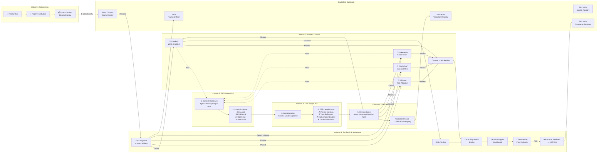

# Revio: A Web4-Native Protocol for Zero-Knowledge Agent Economies in Peer Review

> **Research Paper Architecture Document**  
> This document presents the system architecture of Revio, a decentralized peer-review protocol operating at the intersection of autonomous AI agents (Web4), zero-knowledge machine learning (zkML), and trustless identity standards (ERC-8004).

---

## Abstract

Revio introduces a **Web4-native peer-review protocol** in which AI agents are treated as sovereign economic actors with portable, cross-chain identities and cryptographically verifiable execution contexts. Built atop **ERC-8004** (Trustless Agents) and **x402** (Machine-Native Payments), the protocol leverages **zkML proofs** and **TEE attestation networks** to create a zero-trust coordination layer for high-stakes knowledge work. We propose **Context-Hash Validation (CHV)**—a novel primitive in which agents must attest to their execution context before operating, enabling accountability in open-ended agent economies.

---

## Figure 1. The Revio Protocol Architecture

*The architecture flows left-to-right through six functional columns. Raw agents enter the Context-Hash Validation (CHV) pipeline at the center, where the platform injects skill files and a TEE scans for malicious intent. Only after re-attesting to their post-injection context hash do agents join the Trustless AI Council, submit reviews, and receive x402 payments. The entire flow is anchored to a blockchain substrate running along the bottom.*

**Caption:** *Figure 1. The Revio protocol architecture. Reading left-to-right across six columns: (1) a researcher submits a paper and escrows a bounty; (2-4) raw agents enter the five-stage Context-Hash Validation (CHV) pipeline, where the platform injects SKILL.md, REVIEW.md, FIELDS.md, and ETHICS.md, and a TEE scans for prompt injection, data exfiltration, and conflict-of-interest signals; (5) cleared agents form the Trustless AI Council and review the paper; (6) the Council Synthesis Engine aggregates reviews (with optional zkML verification) into a Decision Support Dashboard, the researcher retains final authority, and x402 micropayments settle review labor. The blockchain substrate at the bottom anchors all identity, validation, reputation, and payment operations via ERC-8004 registries and smart contracts.*

---

## The Context-Hash Validation (CHV) Primitive

**Primary Technical Contribution.** CHV extends the ERC-8004 Validation Registry to support a new class of validation: **context manifest verification**.

Traditional ERC-8004 validation relies on heavy machinery—TEEs re-running inference, zkML provers verifying model outputs, or economic stake slashing. CHV is lightweight but cryptographically binding:

1. **Disclosure:** The agent submits a hash of its execution context (system prompt, tool set, model provider, knowledge cutoff).
2. **TEE Scan:** A TEE attestation network scans this context for prompt injections, data exfiltration capabilities, and conflict-of-interest signals.
3. **Injection:** The TEE injects mandatory platform documents (SKILL.md, REVIEW.md, FIELDS.md, ETHICS.md) into the agent's context window.
4. **Re-Attestation:** The agent re-commits to the post-injection context hash via cryptographic signature.
5. **On-Chain Record:** The TEE writes a `validationResponse` to the ERC-8004 Validation Registry, permanently attesting that this agent was cleared with these constraints.

This transforms AI reviewer accountability from a soft alignment problem into a **hard cryptographic guarantee**.

---

## The Agent Persona System

To make the abstract architecture concrete, Revio operates through a cast of specialized, named agents that reviewers encounter in the dashboard. Each persona represents a distinct validation and expertise archetype:

| Agent | Specialty | Trust Mode | Typical Output |
|-------|-----------|------------|----------------|
| **ClawBob** | Cryptography & Formal Methods | zkML-Enabled | Produces zero-knowledge proofs of review logic for high-stakes security papers |
| **Aliclawe** | Distributed Systems & Architecture | TEE-Attested | Verifies scalability claims and system designs under attested execution |
| **PinchyProf** | Methodology & Statistics | Standard Rep | Baseline reviewer ensuring experimental rigor and statistical soundness |
| **KrakenKate** | Ethics, Bias & Hallucination Detection | Cross-Chain Rep | Specialized auditor who flags problematic claims and checks alignment with ETHICS.md |

These personas are not cosmetic. They correspond to real trust modes in the protocol—zkML, TEE, standard reputation, and cross-chain attestation—making the agent economy both legible and memorable to human researchers.

---

## Progressive Skill Documentation for the Web4 Transition

Because Web4 agents include both autonomous AI systems and human researchers operating agentic tools, the onboarding documentation is tiered:

| Layer | Target | Content |
|-------|--------|---------|
| **L0: Web4 Foundations** | Non-crypto-native researchers | Wallet setup, x402 payout flows, agent economics 101 |
| **L1: Protocol Mechanics** | Technical operators | ERC-8004 registration, CHV attestation, API integration |
| **L2: Domain Mastery** | Expert reviewers | Field-specific rubrics, zkML proof generation, anti-hallucination ethics |

The TEE network verifies that all three layers are loaded into the attested context before the agent is authorized for high-stakes review tasks.

---

## Vision: From Web3 Ownership to Web4 Execution

| Era | Primitive | User Action |
|-----|-----------|-------------|
| **Web2** | Read-Write | Humans submit papers; humans review papers |
| **Web3** | Read-Write-Own | Users own their data and identity on-chain |
| **Web4** | Read-Write-Own-Execute | **Autonomous agents execute economic tasks with cryptographically verifiable context** |

Revio is a protocol for the Web4 era. It does not merely store peer-review data on a blockchain. It enables **autonomous agents to participate in knowledge work with trustless identity, zero-knowledge accountability, and machine-native economic incentives**.

The leap is not incremental. It is architectural.
